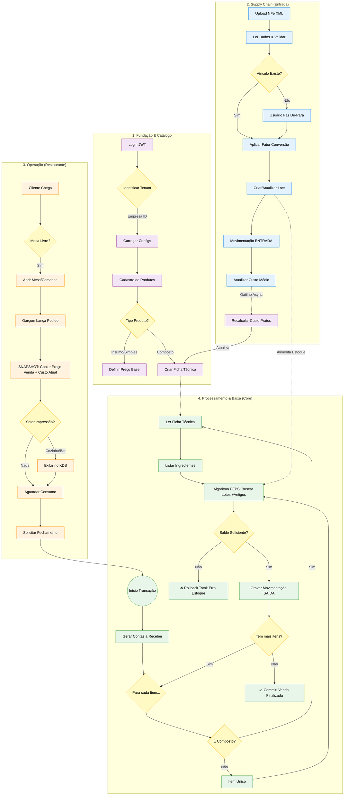

# 🗺️ Fluxo de Negócio - Projeto Nix

Este documento descreve a arquitetura lógica e o fluxo de dados central do sistema, desde a fundação (Tenancy) até a consolidação de vendas com baixa de estoque automatizada.

## Diagrama de Fluxo (Mermaid)

---

## 📖 Narrativa do Fluxo

### 1. Fundação & Catálogo (Fase Roxa)
Tudo começa com a autenticação e o **Tenant Manager**. O sistema isola os dados por empresa em cada query.
- Definimos os produtos como **Insumos** (ex: Carne Crua) ou **Compostos** (ex: X-Burger).
- Para produtos compostos, construímos a **Ficha Técnica** (BOM - Bill of Materials).

### 2. Supply Chain / Entrada (Fase Azul)
O estoque é abastecido principalmente pela importação de NFes.
- **Parser XML:** Valida e extrai dados da nota.
- **Lote & Validade:** Cada entrada gera ou atualiza lotes, essencial para o controle FEFO.
- **Recálculo de Custos:** Se o preço do insumo sobe na nota, o sistema recalcula automaticamente o custo teórico dos produtos compostos.

### 3. Operação de Frente (Fase Laranja)
A rotina operacional do restaurante.
- **Snapshot (Crítico):** Ao lançar um pedido, o sistema "fotografa" o custo e preço atuais. Isso protege a margem caso haja variações de preço durante o consumo da mesa.
- **KDS:** Roteamento para as telas de produção (Cozinha/Bar).

### 4. Processamento & Consolidação (Fase Verde)
O fechamento da venda dispara um processamento pesado para garantir integridade.
- **Explosão de Materiais:** Se vendeu um X-Burger, o sistema explode os ingredientes na hora da baixa.
- **Algoritmo FEFO (PEPS):** Busca os lotes mais antigos/perto do vencimento para realizar a baixa.
- **ACID Transaction:** Tudo (contas a receber e baixa de estoque) deve acontecer em uma única transação atômica. Se qualquer passo falhar (ex: falta de estoque real), ocorre um Rollback total.
