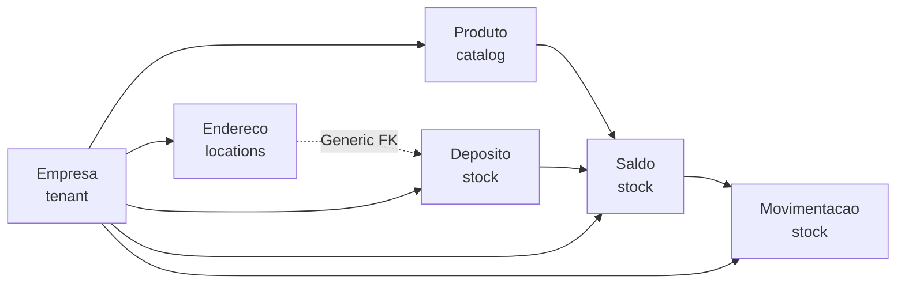

# ProjetoRavenna Backend - Implementation Plan

## Overview
Creating a production-ready Django backend for an ERP/PDV system with multi-tenancy support, following SOLID principles and Domain-Driven Design (DDD). The system uses a "Shared Database, Shared Schema" multi-tenancy strategy with automatic tenant filtering.

## Architecture Principles

### Multi-Tenancy Strategy
- **Shared Database, Shared Schema**: All tenants share the same database and tables
- **Automatic Filtering**: `TenantManager` automatically filters querysets by `empresa`
- **Security**: Prevents data leakage between tenants through manager-level controls

### Technical Standards
- **Primary Keys**: UUID v4 for all models (better for distributed systems and prevents enumeration)
- **Monetary/Quantity Values**: `DecimalField` to avoid floating-point precision issues
- **Timestamps**: `created_at` and `updated_at` on all models via `TenantModel`
- **Soft Deletes**: `is_active` flag for logical deletion
- **Language**: Model names and fields in Portuguese, code in English/Portuguese (consistent)

### Domain-Driven Design
- **Bounded Contexts**: Each app represents a bounded context
- **Separation of Concerns**: 
  - `catalog`: Product definitions (what we sell)
  - `stock`: Physical inventory (where products are)
  - `locations`: Geographic data (where things happen)
  - `core`: Shared infrastructure

## Proposed Changes

### Core Infrastructure

#### [NEW] [core/managers.py](file:///c:/Users/yuri.menezes/Desktop/Projetos/pedidos11/core/managers.py)
Custom manager implementing tenant filtering:
- `TenantManager`: Extends Django's `models.Manager`
- `for_tenant(user)`: Returns queryset filtered by `user.empresa`
- Security: Prevents accidental cross-tenant queries

#### [NEW] [core/models.py](file:///c:/Users/yuri.menezes/Desktop/Projetos/pedidos11/core/models.py)
Abstract base model for all tenant-scoped entities:
- `TenantModel`: Abstract model with common fields
  - `id`: UUID primary key
  - `empresa`: ForeignKey to tenant
  - `created_at`, `updated_at`: Timestamps
  - `is_active`: Soft delete flag
  - `objects`: Uses `TenantManager` by default

---

### Locations Module

#### [NEW] [locations/models.py](file:///c:/Users/yuri.menezes/Desktop/Projetos/pedidos11/locations/models.py)
Generic address model using Django's ContentTypes framework:
- `Endereco`: Polymorphic address model
  - Uses `GenericForeignKey` to link to multiple entity types (Cliente, Fornecedor, Deposito)
  - Supports multiple address types (Cobrança, Entrega, Físico)
  - Complete Brazilian address fields (logradouro, bairro, cidade, UF, CEP)

---

### Catalog Module

#### [NEW] [catalog/models.py](file:///c:/Users/yuri.menezes/Desktop/Projetos/pedidos11/catalog/models.py)
Product catalog definitions (business perspective):

**Categoria**:
- Self-referencing hierarchy (`parent` ForeignKey)
- Slug for URL-friendly identifiers

**Produto**:
- Commercial product definition
- Pricing: `preco_venda`, `preco_custo` (snapshot values)
- Identification: `codigo_barras` (unique per tenant), `sku`
- Product types: Físico, Serviço, Digital
- **Important**: NO stock quantity fields (separation of concerns)

---

### Stock Module

#### [NEW] [stock/models.py](file:///c:/Users/yuri.menezes/Desktop/Projetos/pedidos11/stock/models.py)
Inventory management (logistics perspective):

**Deposito**:
- Physical or virtual warehouse locations
- `is_padrao`: Default warehouse flag
- Examples: Loja Principal, Estoque Virtual, Almoxarifado

**Saldo**:
- Pivot table: Product × Warehouse × Quantity
- `unique_together = ['empresa', 'produto', 'deposito']`
- Current stock levels per location

**Movimentacao**:
- Immutable audit trail of stock movements
- Types: Entrada (in), Saída (out), Balanço (adjustment)
- `valor_unitario`: Cost snapshot at movement time
- **Critical Business Logic**: Atomic updates with row-level locking

> [!IMPORTANT]
> The `Movimentacao.save()` method implements critical business rules:
> - Uses `@transaction.atomic` for ACID compliance
> - Applies `select_for_update()` to prevent race conditions
> - Updates corresponding `Saldo` record atomically
> - Creates `Saldo` if first movement for product+warehouse
> - **Prevents modification** of existing records (append-only for audit integrity)

## Data Flow Example



## Critical Implementation Details

### Race Condition Prevention
```python
@transaction.atomic
def save(self, *args, **kwargs):
    # Lock the Saldo row to prevent concurrent modifications
    saldo = Saldo.objects.select_for_update().get_or_create(
        empresa=self.empresa,
        produto=self.produto,
        deposito=self.deposito
    )
    # Update quantity based on movement type
    # Prevent edits to existing records
```

### Multi-Tenancy Security
All queries must go through the manager:
```python
# Good ✓
produtos = Produto.objects.for_tenant(request.user)

# Bad ✗ - Bypasses tenant filtering
produtos = Produto.objects.all()
```

## Verification Plan

### Code Review Checklist
- [ ] All models inherit from `TenantModel`
- [ ] All models use UUID as primary key
- [ ] All monetary/quantity fields use `DecimalField`
- [ ] `TenantManager` is set as default manager
- [ ] `Movimentacao.save()` implements atomic operations
- [ ] `select_for_update()` prevents race conditions
- [ ] No hardcoded IDs or string-based queries
- [ ] Proper use of `unique_together` constraints

### Manual Testing
After implementation, verify:
1. Create two tenants (empresas)
2. Create products for each tenant
3. Verify tenant A cannot see tenant B's products
4. Test concurrent stock movements (race condition)
5. Verify `Saldo` updates correctly on `Movimentacao` creation
6. Test `Endereco` GenericForeignKey with different entity types
