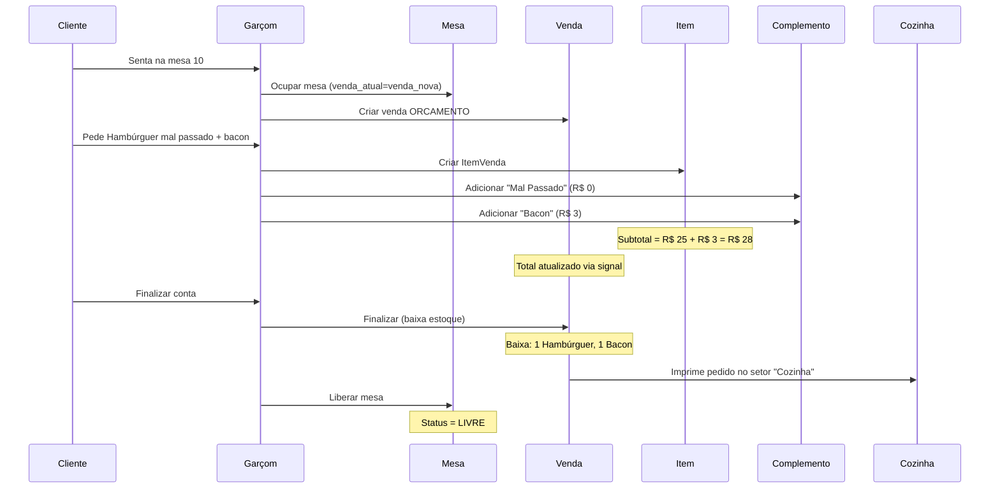

# Módulo Restaurant (Food Service) - Documentação

## ✅ Implementação Completa

Módulo **Food Service** implementado para suportar operação de restaurantes incluindo mesas, comandas, setores de produção e sistema complexo de complementos.

---

## 📦 Arquivos Criados/Modificados

### Novo App: restaurant

#### [restaurant/models.py](file:///C:/Users/yuri.menezes/Desktop/Projetos/pedidos11/restaurant/models.py)

**SetorImpressao** - Define setores de produção
- Campos: nome, slug, ordem, cor
- Uso: Cozinha, Bar, Copa, Churrasco, etc.

**Mesa** - Controle de mesas físicas
- Campos: numero, capacidade, status, venda_atual
- Status: LIVRE, OCUPADA, RESERVADA, SUJA
- Métodos: `ocup ar()`, `liberar()`

**Comanda** - Cartões/fichas individuais
- Campos: codigo, status, venda_atual
- Status: LIVRE, EM_USO, BLOQUEADA
- Métodos: `usar()`, `liberar()`, `bloquear()`

---

### Catalog Extendido

#### Produto - Novos campos
```python
setor_impressao = FK(SetorImpressao)  # Onde imprimir
imprimir_producao = BooleanField(default=True)  # Se imprime
```

#### GrupoComplemento - Agrupa opções
```python
nome = CharField  # ex: "Escolha o Ponto"
obrigatorio = BooleanField
min_qtd, max_qtd = PositiveIntegerField
produtos_vinculados = ManyToManyField(Produto)
```

#### Complemento - Opções individuais
```python
grupo = FK(GrupoComplemento)
nome = CharField  # ex: "Mal Passado"
produto_referencia = FK(Produto, nullable)  # Para baixar estoque
preco_adicional = DecimalField
```

---

### Sales Extendido

#### ItemVenda - Novo campo
```python
observacoes = TextField  # "Sem cebola", "Ponto médio", etc.
```

#### ItemVendaComplemento - NOVO MODEL
```python
item_pai = FK(ItemVenda)
complemento = FK(Complemento)
quantidade = Decimal
preco_unitario = Decimal  # Snapshot
subtotal = Decimal  # Calculado
```

---

## 💡 Exemplos de Uso

### Criar Setores de Impressão

```python
from restaurant.models import SetorImpressao

cozinha = SetorImpressao.objects.create(
    empresa=empresa,
    nome='Cozinha',
    cor='#EF4444',  # Vermelho
    ordem=1
)

bar = SetorImpressao.objects.create(
    empresa=empresa,
    nome='Bar',
    cor='#3B82F6',  # Azul
    ordem=2
)
```

### Configurar Produto com Complementos

```python
from catalog.models import GrupoComplemento, Complemento, Produto

# 1. Criar produto
hamburguer = Produto.objects.create(
    empresa=empresa,
    nome='Hambúrguer Artesanal',
    preço_venda=25.00,
    setor_impressao=cozinha,
    imprimir_producao=True
)

# 2. Criar grupo de ponto da carne (obrigatório)
grupo_ponto = GrupoComplemento.objects.create(
    empresa=empresa,
    nome='Escolha o Ponto',
    obrigatorio=True,
    min_qtd=1,
    max_qtd=1
)
grupo_ponto.produtos_vinculados.add(hamburguer)

# 3. Criar opções
Complemento.objects.create(
    empresa=empresa,
    grupo=grupo_ponto,
    nome='Mal Passado',
    preco_adicional=0.00
)

Complemento.objects.create(
    empresa=empresa,
    grupo=grupo_ponto,
    nome='Ao Ponto',
    preco_adicional=0.00
)

# 4. Criar grupo de adicionais (opcional)
grupo_adicionais = GrupoComplemento.objects.create(
    empresa=empresa,
    nome='Adicionais',
    obrigatorio=False,
    min_qtd=0,
    max_qtd=5
)
grupo_adicionais.produtos_vinculados.add(hamburguer)

# 5. Criar adicionais que baixam estoque
bacon = Produto.objects.get(sku='BACON-001')
ovo = Produto.objects.get(sku='OVO-001')

Complemento.objects.create(
    empresa=empresa,
    grupo=grupo_adicionais,
    nome='Bacon',
    produto_referencia=bacon,  # Baixa estoque de bacon
    preco_adicional=3.00
)

Complemento.objects.create(
    empresa=empresa,
    grupo=grupo_adicionais,
    nome='Ovo',
    produto_referencia=ovo,
    preco_adicional=2.00
)
```

### Criar Venda com Mesa e Complementos (API)

```json
POST /api/vendas/
{
  "vendedor": "uuid-vendedor",
  "cliente": null,
  "tipo_pagamento": "DINHEIRO"
}

// Response: venda criada com número 1005

// Ocupar mesa
POST /api/mesas/{mesa_id}/
{
  "status": "OCUPADA",
  "venda_atual": "uuid-da-venda"
}

// Adicionar item com complementos
POST /api/itens-venda/
{
  "venda": "uuid-da-venda",
  "produto": "uuid-hamburguer",
  "quantidade": 2,
  "observacoes": "Sem cebola",
  "complementos": [
    {
      "complemento": "uuid-mal-passado",
      "quantidade": 1
    },
    {
      "complemento": "uuid-bacon",
      "quantidade": 2  // 2 porções de bacon
    },
    {
      "complemento": "uuid-ovo",
      "quantidade": 1
    }
  ]
}

// Cálculo automático:
// Base: 2 × R$ 25,00 = R$ 50,00
// Complementos: (2 × R$ 3,00) + (1 × R$ 2,00) = R$ 8,00
// Subtotal item: R$ 58,00
```

---

## 🔄 Fluxo Completo: Restaurante



---

## 📊 Signals Atualizados

### Recálculo de Totais

```python
# sales/signals.py

# Quando complemento é adicionado/removido:
1. Recalcula subtotal do ItemVenda (base + complementos - desconto)
2. Recalcula total da Venda (soma todos os itens + complementos)

# Cálculo:
subtotal_item = (qtd × preço) + total_complementos - desconto
total_venda = sum(subtotais_itens)
```

---

## 🎯 API Endpoints (Novos)

```
# Restaurant
GET /api/setores-impressao/
POST /api/setores-impressao/

GET /api/mesas/
POST /api/mesas/
PATCH /api/mesas/{id}/  # Ocupar/liberar

GET /api/comandas/
POST /api/comandas/
POST /api/comandas/{id}/usar/
POST /api/comandas/{id}/liberar/
POST /api/comandas/{id}/bloquear/
```

---

## ✅ Checklist de Implementação

- [x] App `restaurant` criado
- [x] Models: SetorImpressao, Mesa, Comanda
- [x] Validações e métodos de negócio (ocupar, liberar, bloquear)
- [x] Catalog extendido (GrupoComplemento, Complemento)
- [x] Produto com campos setor_impressao e imprimir_producao
- [x] ItemVendaComplemento com snapshot de preços
- [x] Serializers com nested writes (@transaction.atomic)
- [x] Signals atualizados para recálculo com complementos
- [x] App adicionado ao settings.py

---

## 🚀 Próximos Passos

1. ✅ Criar migrations: `python manage.py makemigrations restaurant catalog sales`
2. ✅ Aplicar migrations: `python manage.py migrate`
3. ✅ Testar via Django Admin
4. ✅ Implementar ViewSets para restaurant (opcional)
5. ✅ Criar impressão de pedidos (KDS - Kitchen Display System)

**Módulo Food Service 100% implementado e pronto para uso!** 🎉
