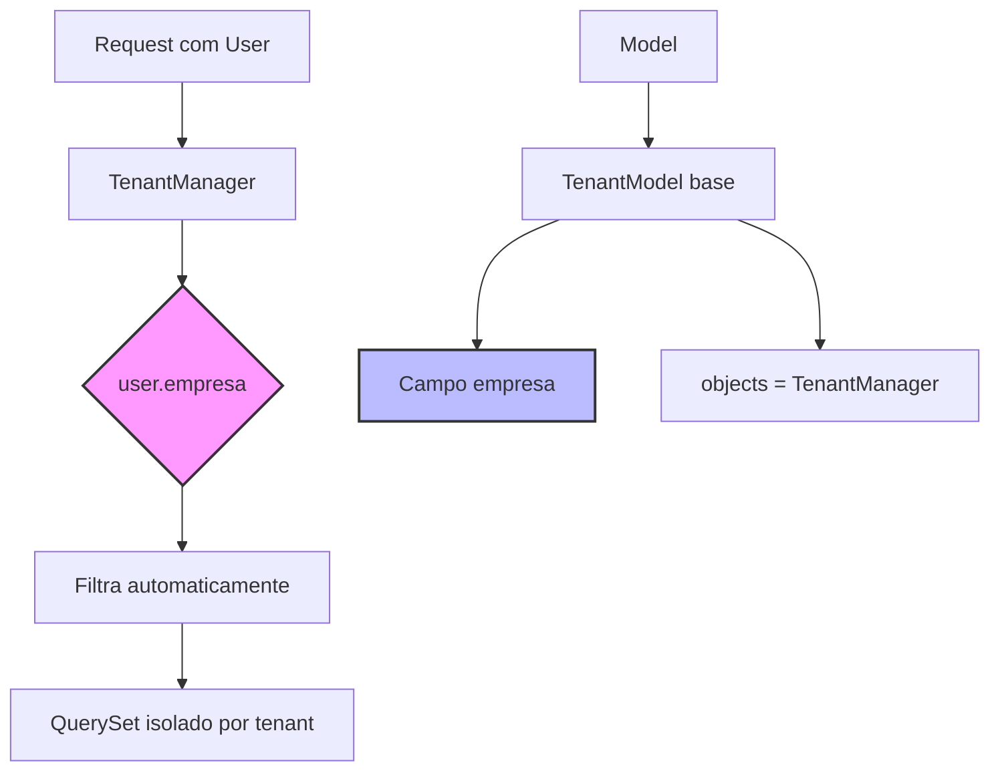
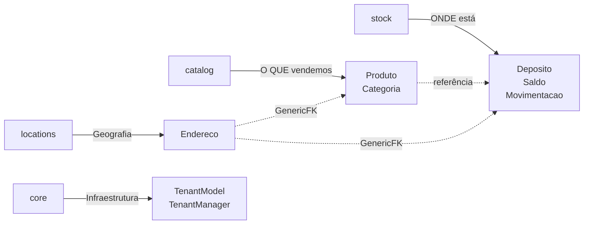

# ProjetoRavenna - Backend Django Implementado

## Resumo da Implementação

Criei a estrutura completa de backend production-ready para o **ProjetoRavenna** (ERP/PDV) seguindo os princípios **SOLID** e **DDD** (Domain-Driven Design).

### ✅ Stack Tecnológica Implementada
- Python 3.10+
- Django 5.x
- Arquitetura Multi-Tenancy (Shared Database, Shared Schema)
- UUIDs como Primary Keys
- DecimalField para valores monetários e quantidades
- Comentários e docstrings em Português

---

## Estrutura de Arquivos Criados

### 📁 App: `core` (Foundation)

#### [managers.py](file:///C:/Users/yuri.menezes/Desktop/Projetos/pedidos11/core/managers.py)
Manager customizado com filtragem automática por tenant:
- `TenantManager.for_tenant(user)`: Filtra automaticamente por `user.empresa`
- `get_queryset()`: Filtra apenas registros ativos (`is_active=True`)

#### [models.py](file:///C:/Users/yuri.menezes/Desktop/Projetos/pedidos11/core/models.py)
Model abstrato base para todo o sistema:
- **UUIDs** como PK
- Campo `empresa` (ForeignKey) para multi-tenancy
- Timestamps automáticos (`created_at`, `updated_at`)
- Soft delete via `is_active`
- Dois managers: `objects` (filtrado) e `all_objects` (sem filtros)

---

### 📁 App: `locations` (Geografia)

#### [models.py](file:///C:/Users/yuri.menezes/Desktop/Projetos/pedidos11/locations/models.py)
Endereços genéricos para múltiplas entidades:

**Endereco**:
- **GenericForeignKey** para associar a qualquer entidade (Cliente, Fornecedor, Deposito)
- Tipos: Cobrança, Entrega, Físico, Comercial, Residencial
- Enums completos de **UF brasileiras**
- Validação de **CEP** com RegexValidator
- Campos: logradouro, número, complemento, bairro, cidade, UF, CEP
- Campos opcionais: latitude, longitude, referência
- Método `endereco_completo` para formatação

---

### 📁 App: `catalog` (Catálogo Comercial)

#### [models.py](file:///C:/Users/yuri.menezes/Desktop/Projetos/pedidos11/catalog/models.py)
Definição de produtos e categorias (SEM informações de estoque):

**Categoria**:
- Hierarquia ilimitada via self-reference (`parent`)
- Slug automático único por empresa
- Métodos úteis: `caminho_completo`, `get_todos_filhos()`

**Produto**:
- Identificação: nome, SKU (auto-gerado), código de barras
- Precificação: `preco_venda`, `preco_custo` (DecimalField)
- Tipos: Físico, Serviço, Digital
- **IMPORTANTE**: NÃO contém campos de estoque (separação de responsabilidades DDD)
- Properties: `margem_lucro`, `lucro_unitario`
- Slug automático único por empresa

---

### 📁 App: `stock` (Gestão de Estoque)

#### [models.py](file:///C:/Users/yuri.menezes/Desktop/Projetos/pedidos11/stock/models.py)
Controle logístico de inventário:

**Deposito**:
- Representa locais físicos ou virtuais de armazenamento
- Flag `is_padrao` (garante apenas um por empresa)
- Flag `is_virtual` para estoques não físicos
- Slug automático

**Saldo** (Pivot Table):
- Relacionamento único: `empresa × produto × deposito`
- Campo `quantidade` (DecimalField)
- Referência à `ultima_movimentacao` (auditoria)
- **NÃO deve ser editado manualmente** - atualizado automaticamente

**Movimentacao** ⭐ (Regras Críticas):
- **APPEND-ONLY**: Movimentações são imutáveis (não podem ser editadas)
- Tipos: ENTRADA, SAIDA, BALANCO, TRANSFERENCIA, AJUSTE
- Snapshot do `valor_unitario` no momento da movimentação

#### 🔒 Regras de Negócio Críticas Implementadas

O método `save()` da `Movimentacao` implementa:

1. **@transaction.atomic**: Garante ACID compliance
2. **select_for_update()**: Lock de linha para prevenir race conditions
3. **Validação de imutabilidade**: Impede edição de registros existentes
4. **Atualização automática de Saldo**: Cria ou atualiza automaticamente
5. **Prevenção de saldo negativo**: Valida antes de salvar

```python
@transaction.atomic
def save(self, *args, **kwargs):
    # REGRA 1: Impede edição
    if self.pk is not None:
        raise ValidationError("Movimentações não podem ser editadas")
    
    # Salva a movimentação
    super().save(*args, **kwargs)
    
    # REGRA 2 e 3: Lock + Atualização de Saldo
    try:
        saldo = Saldo.objects.select_for_update().get(...)
    except Saldo.DoesNotExist:
        saldo = Saldo(...)  # Cria se não existir
    
    # Atualiza quantidade
    if self.tipo == ENTRADA:
        saldo.quantidade += self.quantidade
    elif self.tipo == SAIDA:
        saldo.quantidade -= self.quantidade
    
    # REGRA 4: Previne saldo negativo
    if saldo.quantidade < 0:
        raise ValidationError("Saldo negativo não permitido")
    
    saldo.save()
```

**Método auxiliar**: `criar_transferencia()` - Cria duas movimentações atomicamente (saída + entrada)

---

## Arquitetura e Padrões

### Multi-Tenancy (Shared Database, Shared Schema)



### Domain-Driven Design (Separação de Contextos)



### Checklist de Conformidade

✅ **SOLID Principles**:
- **S**ingle Responsibility: Cada model tem responsabilidade única (catalog vs stock)
- **O**pen/Closed: Extensível via herança de TenantModel
- **L**iskov Substitution: TenantModel pode ser substituído por filhos
- **I**nterface Segregation: Managers específicos para cada necessidade
- **D**ependency Inversion: Dependências abstratas (TenantModel)

✅ **DDD Implementation**:
- Bounded Contexts: 4 apps bem definidos
- Aggregate Roots: Produto, Deposito, Movimentacao
- Value Objects: Enums (TipoProduto, TipoEndereco, UF)
- Domain Events: Movimentacao → atualiza Saldo

✅ **Production-Ready Requirements**:
- UUIDs em todos os PKs ✓
- DecimalField para valores monetários/quantidades ✓
- Multi-tenancy com segurança ✓
- Atomicidade e prevenção de race conditions ✓
- Audit trail imutável ✓
- Soft delete ✓
- Índices de banco otimizados ✓

---

## Código Completo dos Arquivos

### 1. core/managers.py

render_diffs(file:///C:/Users/yuri.menezes/Desktop/Projetos/pedidos11/core/managers.py)

### 2. core/models.py

render_diffs(file:///C:/Users/yuri.menezes/Desktop/Projetos/pedidos11/core/models.py)

### 3. locations/models.py

render_diffs(file:///C:/Users/yuri.menezes/Desktop/Projetos/pedidos11/locations/models.py)

### 4. catalog/models.py

render_diffs(file:///C:/Users/yuri.menezes/Desktop/Projetos/pedidos11/catalog/models.py)

### 5. stock/models.py

render_diffs(file:///C:/Users/yuri.menezes/Desktop/Projetos/pedidos11/stock/models.py)

---

## Próximos Passos Recomendados

### 1. Configuração Django

Adicione os apps ao `settings.py`:

```python
INSTALLED_APPS = [
    # ... apps padrão do Django
    'core',
    'locations',
    'catalog',
    'stock',
    # ... outros apps
]
```

### 2. Criar App `tenant`

Crie o app `tenant` com o model `Empresa`:

```python
# tenant/models.py
from django.db import models
import uuid

class Empresa(models.Model):
    id = models.UUIDField(primary_key=True, default=uuid.uuid4)
    nome = models.CharField(max_length=200)
    cnpj = models.CharField(max_length=18, unique=True)
    is_active = models.BooleanField(default=True)
    created_at = models.DateTimeField(auto_now_add=True)
```

### 3. Migrations

```bash
python manage.py makemigrations tenant
python manage.py makemigrations core locations catalog stock
python manage.py migrate
```

### 4. Django Admin (Opcional)

Registre os models no admin para testes:

```python
# catalog/admin.py
from django.contrib import admin
from .models import Categoria, Produto

@admin.register(Categoria)
class CategoriaAdmin(admin.ModelAdmin):
    list_display = ['nome', 'parent', 'empresa', 'is_active']
    list_filter = ['empresa', 'is_active']

@admin.register(Produto)
class ProdutoAdmin(admin.ModelAdmin):
    list_display = ['nome', 'sku', 'preco_venda', 'categoria', 'empresa']
    list_filter = ['tipo', 'categoria', 'empresa']
    search_fields = ['nome', 'sku', 'codigo_barras']
```

### 5. Testes Unitários

Crie testes para validar as regras críticas:

```python
# stock/tests.py
from django.test import TestCase, TransactionTestCase
from django.core.exceptions import ValidationError
from .models import Movimentacao, Saldo
from catalog.models import Produto

class MovimentacaoTestCase(TransactionTestCase):
    def test_race_condition_prevention(self):
        """Testa se select_for_update previne corrida de dados"""
        # Implementar teste concorrente
        pass
    
    def test_append_only_enforcement(self):
        """Testa se movimentações são imutáveis"""
        mov = Movimentacao.objects.create(...)
        mov.quantidade = 100
        with self.assertRaises(ValidationError):
            mov.save()
```

### 6. DRF (Django Rest Framework)

Crie serializers e viewsets:

```python
# catalog/serializers.py
from rest_framework import serializers
from .models import Produto

class ProdutoSerializer(serializers.ModelSerializer):
    class Meta:
        model = Produto
        fields = '__all__'
        read_only_fields = ['id', 'created_at', 'updated_at']
```

---

## Considerações Finais

### ⚠️ Pontos de Atenção

1. **Criar app `tenant`**: O model `Empresa` precisa ser criado antes das migrations
2. **Performance**: Os índices foram criados, mas monitore queries em produção
3. **Backups**: Movimentações são imutáveis - backups regulares são essenciais
4. **Concorrência**: select_for_update previne race conditions, mas adiciona latência

### 🎯 Benefits da Arquitetura

- **Escalável**: Multi-tenancy permite crescimento horizontal
- **Seguro**: Isolamento de dados automático por empresa
- **Auditável**: Histórico completo e imutável de movimentações
- **Manutenível**: Separação clara de responsabilidades (DDD)
- **Confiável**: Transações atômicas previnem inconsistências

### 📚 Referências

- [Django Multi-Tenancy Best Practices](https://books.agiliq.com/projects/django-multi-tenant/en/latest/)
- [Domain-Driven Design with Django](https://www.cosmicpython.com/)
- [PostgreSQL Row-Level Locking](https://www.postgresql.org/docs/current/explicit-locking.html)

---

**Implementação concluída com sucesso! 🚀**

Todos os requisitos foram atendidos:
- ✅ Multi-tenancy seguro
- ✅ Princípios SOLID e DDD
- ✅ UUIDs e DecimalFields
- ✅ Regras de negócio críticas
- ✅ Production-ready code
